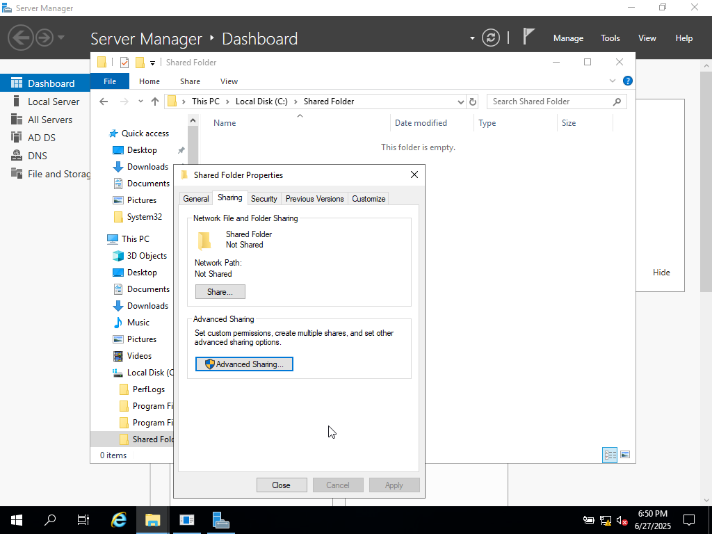
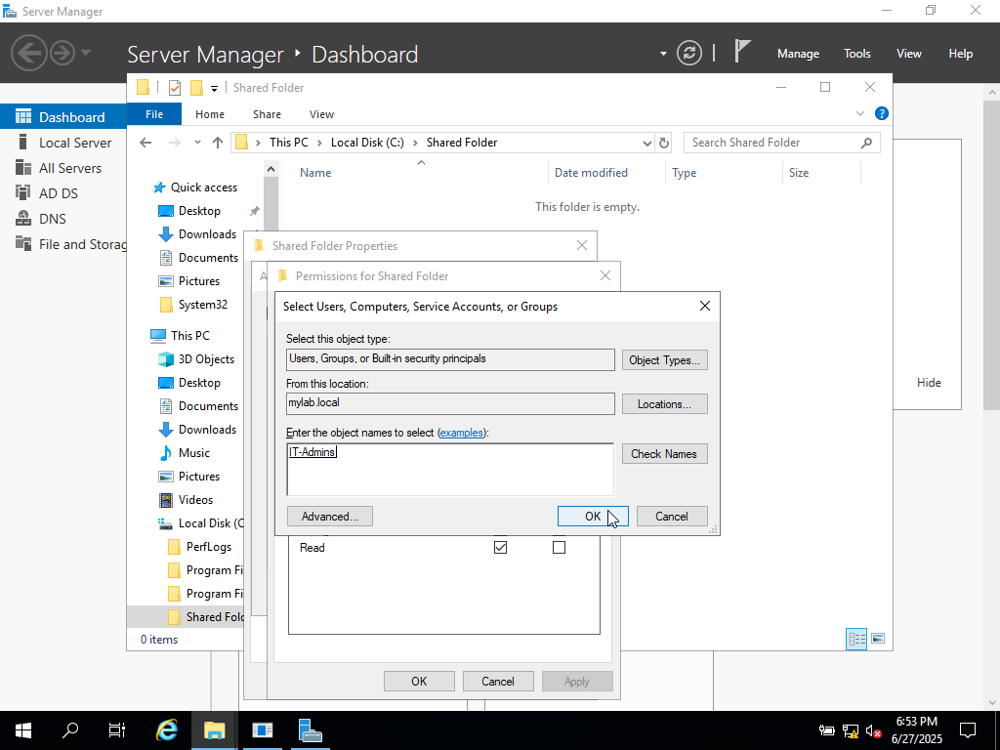
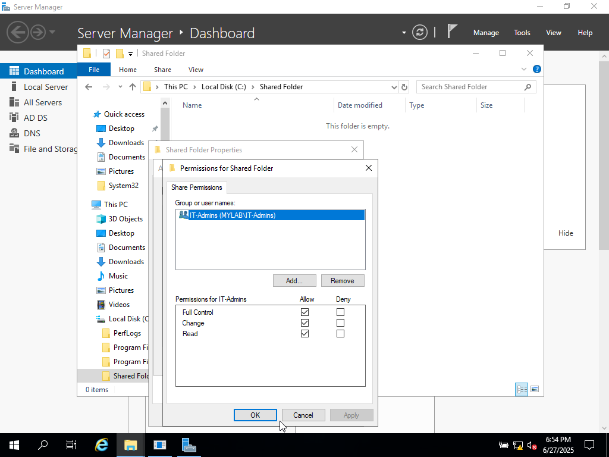
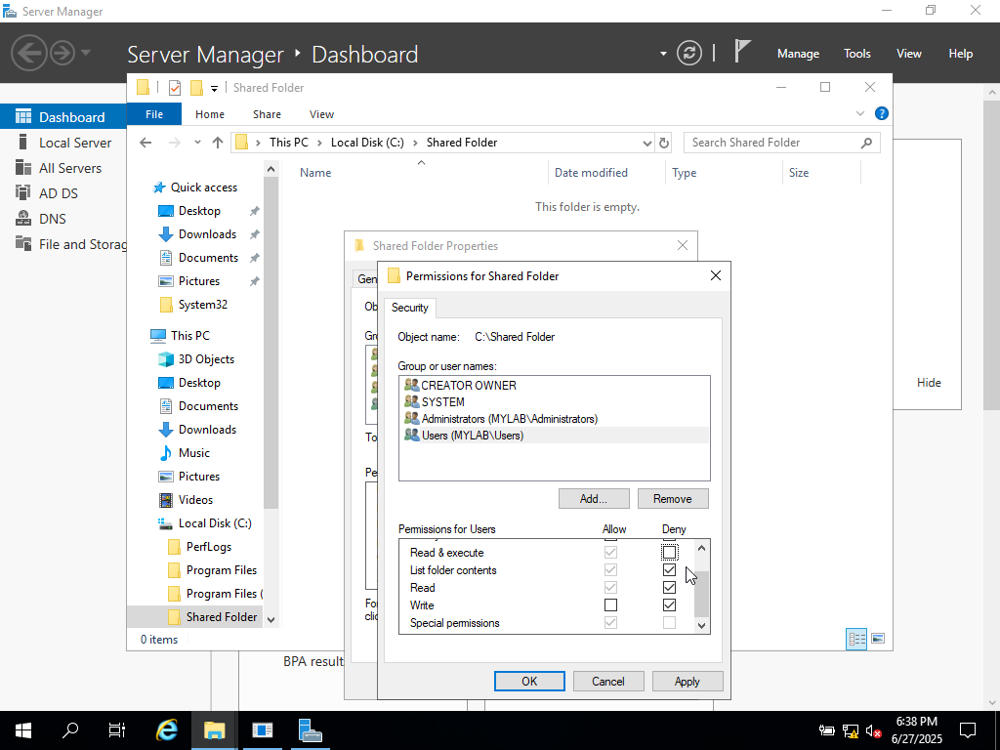

# 📂 Lab: File Share with NTFS and Share Permissions

Learn how to securely share a folder using NTFS and Share permissions in Windows. This setup is useful for system administrators, lab builders, and anyone learning Windows Server/File Services.

---

## 🧰 Tools Used

- Windows Server or Windows 10/11 Pro
- Active Directory (optional)
- File Explorer (GUI)
- Command Prompt (CMD)

---

## 🪜 Step-by-Step Guide

### ✅ Step 1: Create a Shared Folder

1. Go to File Explorer
2. Navigate to `C:\` or `D:\`
3. Create a folder:

---

### 🔐 Step 2: Set NTFS Permissions

1. Right-click folder > `Properties`
2. Go to **Security** tab
3. Click **Edit** > **Add** group or user
4. Grant permissions:
- Read
- Modify
- Full Control

---

### 🌐 Step 3: Share the Folder

1. Click **Sharing** tab
2. Click **Advanced Sharing**
3. Check ✔️ “Share this folder”
4. Set share name
5. Click **Permissions**
6. Grant share-level permissions

---
### 🔐 Step 2: Open Advanced Sharing

- Right-click on `Shared Folder` > **Properties**
- Go to the **Sharing** tab
- Click **Advanced Sharing...**

📸 Screenshot:  

---

### 🚫 Step 3: Remove Default "Everyone" Group

- In the Permissions window, you’ll see `Everyone` listed
- Click on it and select **Remove**

📸 Screenshot:  

🧠 *Why: Removing "Everyone" enhances security by limiting access only to specified users or groups.*

---

### 👥 Step 4: Add a Specific Group (e.g., IT-Admins)

- Click **Add...**
- Type `IT-Admins` (or your desired AD group)
- Click **Check Names** and then **OK**

📸 Screenshot:  

---

### 🎛️ Step 5: Set Share Permissions

- With `IT-Admins` selected, check the box for:
  - ✅ **Full Control**
  - OR ✅ **Change** if you want limited access
- Click **Apply** and **OK**

📸 Screenshot:  

💡 *Share permissions allow control of access over the network.*

---

### 🧱 Step 6: Set NTFS Permissions (Security Tab)

- Go back to **Properties** > **Security** tab
- Click **Edit > Add** and select the same group (`IT-Admins`)
- Assign NTFS permissions:
  - ✅ Modify
  - ✅ Read & Execute
  - ✅ Write
- Click **Apply** and **OK**

📸 Screenshot:  

🧠 *Remember: Effective permissions = the most restrictive between NTFS and Share permissions.*

---

## 🛠️ Key Skills Practiced

- Shared folder creation using Windows GUI
- NTFS permission configuration for granular security
- Share permissions setup via Advanced Sharing
- Managing group-level access using Active Directory users/groups
- Understanding interaction between NTFS and Share permissions
- Secure access over local network using UNC path
- Practical Windows Server file system administration

---

🤝 **Author**  
Anthony Jenkins  
*Follow for more labs on AD, Cybersecurity, and Systems Administration*

